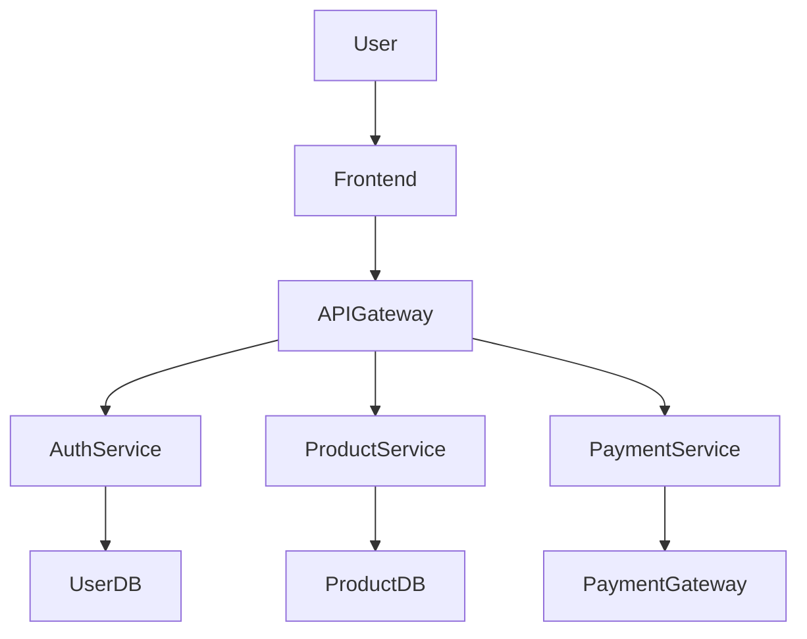

# AI Architecture Agent

Generate software architecture diagrams from plain English requirements using AI and Mermaid.

## Overview

AI Architecture Agent converts requirements into architecture diagrams using:

* Next.js
* TypeScript
* Mermaid
* Ollama
* Local AI Models (Llama/Qwen)

---

## Prerequisites

Before starting this project, complete the following setup guides from the AI Engineering Playbook repository:

### 1. Install Node.js

Follow:

https://github.com/thecuriousarchitect09/ai-engineering-playbook/blob/main/install-nodejs-homebrew.md

---

### 2. Install Ollama

Follow:

https://github.com/thecuriousarchitect09/ai-engineering-playbook/blob/main/Ollama%20Installation%20Guide%20(macOS).md

After installation, verify:

```bash
ollama --version
```

Pull a model:

```bash
ollama pull qwen3:8b
```

or

```bash
ollama pull llama3.1:8b
```

Start Ollama:

```bash
ollama serve
```

---

### 3. Learn Next.js Basics

If you're new to Next.js, review:

https://github.com/thecuriousarchitect09/ai-engineering-playbook/blob/main/nextjs-getting-started.md

---

## Create Project

```bash
npx create-next-app@latest ai-architecture-agent --typescript --app

cd ai-architecture-agent
```

---

## Install Dependencies

```bash
npm install mermaid
```

---

## Start Development Server

```bash
npm run dev
```

Open:

```text
http://localhost:3000
```

---

## Project Structure

```text
app/
├── api/
│   └── generate/
│       └── route.ts
│
├── components/
│   └── MermaidDiagram.tsx
│
├── globals.css
├── layout.tsx
└── page.tsx
```

---

## Example Requirement

```text
Build an ecommerce platform.

Features:
- Authentication
- Product Catalog
- Inventory
- Payments
- Notifications
```

---

## Example Diagram



---

## Roadmap

### Phase 1

Requirement → Mermaid Diagram

### Phase 2

Requirement → Architecture Review

### Phase 3

Requirement → Technology Recommendations

### Phase 4

Requirement → Draw.io Export

### Phase 5

Requirement → Multi-Agent Architecture Copilot

---

## Related Repositories

### AI Engineering Playbook

https://github.com/thecuriousarchitect09/ai-engineering-playbook

Contains:

* Node.js Installation Guide
* Ollama Installation Guide
* Next.js Getting Started Guide
* AI Engineering Learning Materials

---

## License

MIT
