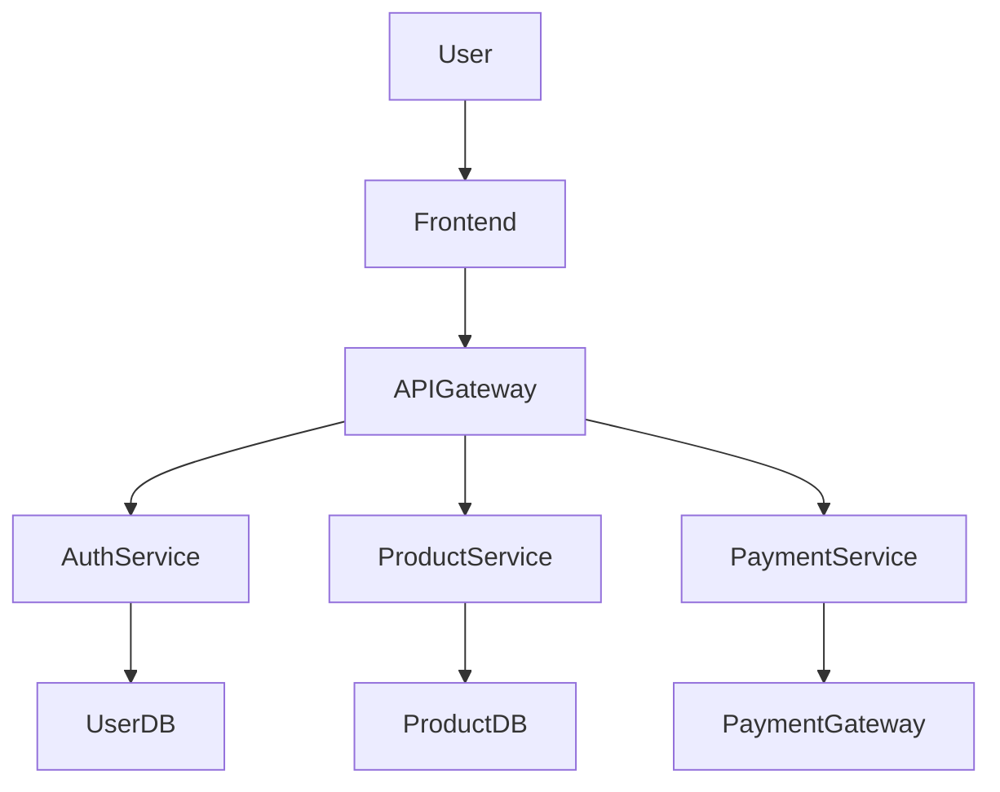

# AI Architecture Agent

Generate software architecture diagrams from plain English requirements using AI and Mermaid.


---

## Overview

AI Architecture Agent converts business or technical requirements into architecture diagrams.

Example:

### Input

Build an e-commerce platform with:

* Authentication
* Product Catalog
* Inventory Management
* Payments
* Notifications

### Output



Rendered directly in the browser using Mermaid.

---

## Features

* AI-powered architecture generation
* Mermaid diagram rendering
* Modern Dracula dark theme
* Next.js App Router
* TypeScript
* Ollama integration ready
* Vercel deployment ready

---

## Tech Stack

| Technology       | Purpose                 |
| ---------------- | ----------------------- |
| Next.js 15       | Frontend & API          |
| TypeScript       | Type Safety             |
| Mermaid          | Diagram Rendering       |
| Ollama           | Local AI Models         |
| Llama 3 / Qwen 3 | Architecture Generation |
| Vercel           | Hosting                 |

---

## Project Structure

```text
app/
├── api/
│   └── generate/
│       └── route.ts
│
├── components/
│   └── MermaidDiagram.tsx
│
├── globals.css
├── layout.tsx
└── page.tsx
```

---

## Getting Started

### Prerequisites

Install:

* Node.js 20+
* npm
* Ollama 

---

## Create Project

```bash
npx create-next-app@latest ai-architecture-agent --typescript --app

cd ai-architecture-agent
```

---

## Install Dependencies

```bash
npm install mermaid
```

---

## Run Locally

```bash
npm run dev
```

Open:

```text
http://localhost:3000
```

---

## Using Ollama

Install Ollama.

Start Ollama:

```bash
ollama serve
```

Pull a model:

```bash
ollama pull qwen3:8b
```

or

```bash
ollama pull llama3.1:8b
```

---

## Example Prompt

```text
Build a hospital management system.

Requirements:

- Patient Management
- Doctor Portal
- Billing
- Appointment Scheduling
- Notifications
```

---

## Future Enhancements

### Phase 1

* Requirement → Mermaid Diagram

### Phase 2

* Requirement → Architecture Review

### Phase 3

* Requirement → Technology Recommendations

### Phase 4

* Requirement → Draw.io Export

### Phase 5

* Requirement → C4 Model Generation

### Phase 6

* Multi-Agent Architecture Copilot

---

## License

MIT License

---

Built for learning Agentic AI, Software Architecture, and AI-powered Diagram Generation.
